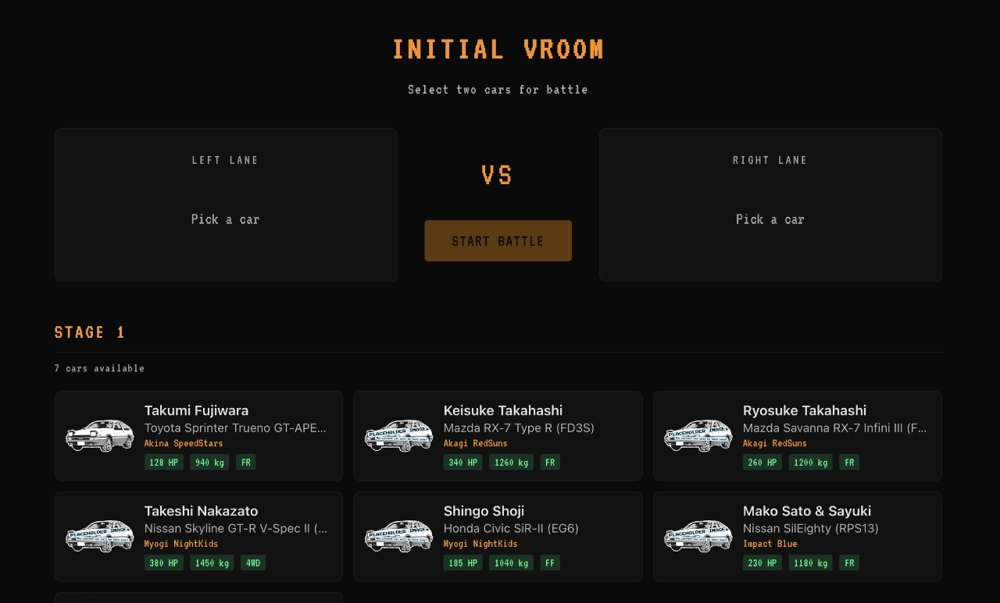
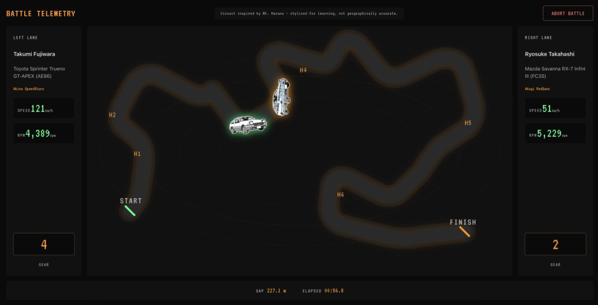
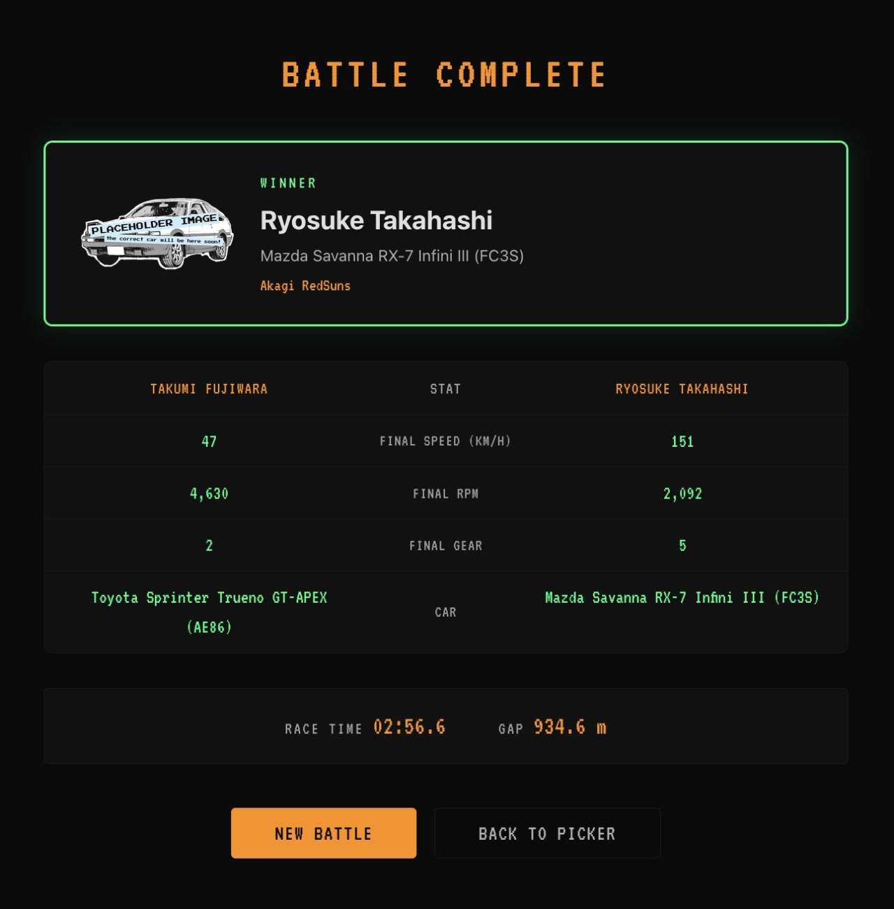

# INITIAL VROOM

### A Full-Stack Race Telemetry Simulator and Visualizer

**[Live Demo](https://initial-vroom-frontend.onrender.com)** — hosted on Render

**INITIAL VROOM** is a full-stack telemetry platform that simulates head-to-head mountain pass battles and visualizes the results in a real-time dashboard. Inspired by the legendary street races on _Mt. Akina_ from the anime **Initial D** and by the endurance data streams of **Le Mans**, this project demonstrates real-time data streaming, dual-protocol APIs (REST + WebSocket), containerized microservices, document-based data modeling, and a custom-built frontend with accessibility practices aimed at WCAG AAA (contrast, target sizes, focus-visible states, and reduced motion).

---

## Why This Project Exists

While researching project ideas as a junior developer, I came across the **automotive dashboard and telemetry industry** -- companies that build embedded instrument clusters, ECU diagnostic tools, and real-time performance displays for car manufacturers. It was a domain I knew nothing about, which made it a perfect learning target.

I connected it to two personal interests: the anime **Initial D** (mountain pass racing where car tuning and driver skill matter more than raw power) and **Le Mans** (24-hour endurance races with live telemetry streams). From there, I researched what data a real telemetry system would need -- speed, RPM, gear, engine specs, weight, drivetrain -- and scoped a project that would be **simple enough to finish** but **technical enough to demonstrate real skills**.

Two technology choices were deliberate learning goals:
- **Angular** -- to practice building a structured, typed frontend with standalone components and RxJS.
- **MongoDB** -- first-time use of a document database, in a context where its strengths (flexible schemas, JSON-native storage) are a natural fit.

---

## The Stack

| Layer | Technology | Version | Purpose |
|:------|:-----------|:--------|:--------|
| **Frontend** | Angular | 18.2 | Standalone components, RxJS stream management, CSS custom properties |
| **Backend** | Java / Spring Boot | 21 / 3.2 | REST API, WebSocket broker, simulation engine |
| **Database** | MongoDB | latest | Document store for car specifications (14 cars, 15 fields each) |
| **Communication** | REST + STOMP/SockJS | -- | REST for commands (start/stop), STOMP over WebSocket for 20Hz telemetry |
| **CSV Parsing** | OpenCSV | 5.9 | Seed data loader with annotation-based column mapping |
| **DevOps** | Docker Compose | -- | Three-service containerization (MongoDB, backend, frontend) |

---

## Project Structure

```
initial-vroom/
├── backend/                        # Spring Boot application
│   ├── src/main/java/com/initialvroom/
│   │   ├── config/                 # DataInitializer, WebSocketConfig, BooleanConverter
│   │   ├── controller/             # CarController (REST), BattleController (REST)
│   │   ├── dto/                    # TelemetryDTO, BattleTelemetryDTO, BattleRequest
│   │   ├── entity/                 # Car (MongoDB document)
│   │   ├── repository/             # CarRepository (Spring Data MongoDB)
│   │   └── service/                # RaceSimulationService (the simulation engine)
│   ├── src/main/resources/
│   │   ├── data/                   # CSV seed files (stage1 + stage2 cars)
│   │   ├── application.properties            # Shared defaults
│   │   ├── application-local.properties      # Local dev (localhost MongoDB)
│   │   └── application-docker.properties     # Docker compose profile
│   ├── Dockerfile
│   └── pom.xml
├── frontend/                       # Angular application
│   ├── src/app/
│   │   ├── battle-picker/          # Car selection screen
│   │   ├── dashboard/              # Live telemetry dashboard
│   │   ├── battle-results/         # Post-race results screen
│   │   ├── track-map/              # SVG mountain pass with car sprites
│   │   ├── models/                 # TypeScript interfaces (Car, Telemetry)
│   │   └── services/               # CarService, BattleService, TelemetryService, BattleResultService
│   ├── src/styles.css              # Global design tokens ("Midnight Run" palette)
│   ├── nginx.conf                  # Static file server config for Docker
│   ├── Dockerfile
│   └── package.json
├── docker-compose.yml
├── docs/
│   └── screenshots/              # README UI assets (WebP)
└── README.md
```

---

## Docker Architecture

The application runs as three containers orchestrated by Docker Compose:

```
┌─────────────────────────────────────────────────────────────────┐
│                        docker-compose                           │
│                                                                 │
│  ┌──────────────┐    ┌──────────────────┐    ┌──────────────┐  │
│  │   MongoDB     │◄───│  Spring Boot     │    │  nginx       │  │
│  │   :27017      │    │  :8081           │    │  :80 → :4200 │  │
│  │               │    │                  │    │              │  │
│  │  cars         │    │  REST API        │    │  Angular SPA │  │
│  │  collection   │    │  WebSocket       │    │  static files│  │
│  │               │    │  Simulation      │    │              │  │
│  └──────────────┘    └──────────────────┘    └──────────────┘  │
│   db-mongo-initial    initial-vroom-back      initial-vroom-front│
└─────────────────────────────────────────────────────────────────┘
```

| Service | Container | Port | Description |
|:--------|:----------|:-----|:------------|
| **Database** | `db-mongo-initial` | 27017 | MongoDB instance, stores the `cars` collection |
| **Backend** | `initial-vroom-back` | 8081 | Spring Boot: REST API, STOMP WebSocket broker, race simulation engine |
| **Frontend** | `initial-vroom-front` | 4200 | Angular production build served by nginx (static files only) |

The browser calls the backend API directly (same pattern as chaotic-the-harmony). nginx only serves the static Angular files. CORS is configured on the backend to allow cross-origin requests from the frontend.

When you build the stack with Compose, the frontend container is built with the Angular **development** configuration (`NG_CONFIG` in [docker-compose.yml](docker-compose.yml)), so the SPA uses **localhost** URLs for the REST API and WebSocket. Your browser then reaches the backend at **localhost:8081** via the published port, not an in-cluster hostname.

---

## Data Pipeline

Car data flows from version-controlled CSV files through the backend into MongoDB, then to the Angular frontend via REST:

```
CSV files (14 cars) ──► DataInitializer (CommandLineRunner) ──► MongoDB
                              ▲ OpenCSV @CsvBindByName
                                                                   │
Angular BattlePickerComponent ◄── CarService (HttpClient) ◄── CarController (REST) ◄──┘
         │
         │  user selects 2 cars
         ▼
BattleService ──► POST /api/battles { car1Id, car2Id } ──► BattleController ──► RaceSimulationService
                                                                                        │
                                                                          @Scheduled(50ms)
                                                                                        │
DashboardComponent ◄── TelemetryService (STOMP/SockJS) ◄── /topic/race ◄───────────────┘
         │
         │  race finishes
         ▼
BattleResultsComponent ◄── BattleResultService (in-memory)
```

---

## The Race Simulation

The `RaceSimulationService` is the core of the backend. It runs a **server-side simulation** at 20Hz (one tick every 50ms) and broadcasts telemetry over WebSocket.

**Why server-side?** The server is the single source of truth. In a real telemetry system, the dashboard never generates data -- it only displays it. This architecture mirrors that.

**How car stats drive the simulation:**

| Stat | Effect |
|:-----|:-------|
| HP + Weight | Power-to-weight ratio (`carHp / weightKg`) drives max speed, acceleration, and cornering speed |
| Drivetrain | `4WD` gets an 8% speed bonus through hairpin zones (better traction) |
| Aspiration | `Turbo` / `Twin Turbo` gets a 4% speed bonus on straights |
| Redline RPM | Scales the RPM gauge display (cosmetic, does not affect physics) |
| Torque, Engine Code | Stored for display on car cards; not used in simulation |

**Key design decisions:**
- **5 hairpin zones** at fixed progress intervals inspired by Akina's consecutive hairpins. Cars brake at 2.5x their acceleration rate entering hairpins.
- **Random jitter** of +/- 2 km/h per tick makes races non-deterministic -- the same matchup can produce different outcomes.
- **Gear and RPM are cosmetic** -- gear is a step function of speed, RPM interpolates linearly within each gear band. Visually correct, not a transmission simulation.

---

## Aesthetic and Design

The project uses a **"Midnight Run"** theme -- a deliberate homage to early 90s standalone engine management systems:

- **VT323 monospaced font**: mimics the pixel-perfect text of old ECU monitors.
- **Amber and green on pitch black**: the classic color palette of instrument clusters and oscilloscopes.
- **High-contrast, data-dense layout**: information density over decoration, exactly like a real telemetry readout.
- **Accessibility**: design tokens target strong contrast; interactive controls use at least 44x44px targets; focus-visible states on controls; `prefers-reduced-motion` respected globally. Validate contrast in your environment if you need formal WCAG sign-off.
- **SVG mountain pass**: hand-drawn topographic track with contour lines, 6 labeled hairpin markers (the backend simulates 5 braking zones; the SVG labels are independent visual references), and car sprites positioned via `getPointAtLength()`.

---

## Features

- **Battle Picker** -- Browse the 14-car roster (7 Stage 1, 7 Stage 2) grouped by difficulty, loaded from MongoDB. Select two opponents for a head-to-head race.
- **Live Dual Dashboard** -- Real-time gauges (speed, RPM, gear) for both cars, updated at 20Hz via STOMP/SockJS WebSocket. SVG track map with animated car sprites.
- **Battle Results** -- Post-race screen showing the winner, a side-by-side stat comparison, race time, and gap distance.
- **REST + WebSocket API** -- REST for data queries and battle commands; WebSocket for continuous telemetry. Demonstrates both protocols working together.
- **Containerized Workflow** -- Launch the entire stack (database, API, UI) with a single `docker-compose up --build` (or `docker compose up --build` with Compose V2).

---

## Screenshots

The captures below use a **1280px-wide** viewport. On the battle picker, **Stage 2** cars sit below the fold; scroll the page to browse both stages.

### Battle picker



### Live dashboard



### Battle results



---

## Quick Start

### Prerequisites

- [Docker Desktop](https://www.docker.com/products/docker-desktop/) installed and running
- Git

### Steps

1. **Clone the repository**

```bash
git clone https://github.com/purrtatogon/initial-vroom.git
cd initial-vroom
```

2. **Build and launch all services**

```bash
docker-compose up --build
```

If you use Docker Compose V2, run `docker compose up --build` instead.

This starts MongoDB, the Spring Boot backend, and the Angular frontend. First build takes a few minutes.

3. **Open the app**

Navigate to [`http://localhost:4200`](http://localhost:4200) in your browser. You will land on the **Battle Picker**. Select two cars and click **Start Battle**.

4. **Stop the stack**

```bash
docker-compose down
```

With Compose V2: `docker compose down`.

### Local Development (without Docker)

To run the backend and frontend separately for development:

**Backend** (requires Java 21 and Maven):
```bash
cd backend
mvn spring-boot:run -Dspring-boot.run.profiles=local
```
The backend starts on `http://localhost:8081`. The `local` profile sets `spring.data.mongodb.uri` to `mongodb://localhost:27017/vroom` (see `application-local.properties`). Requires MongoDB listening on `localhost:27017`.

**Frontend** (requires Node.js 20+):
```bash
cd frontend
npm install
npm start
```
The Angular dev server starts on `http://localhost:4200`. The `environment.ts` file points API calls to `http://localhost:8081` automatically.

---

## API Reference

### REST Endpoints

| Method | Endpoint | Request Body | Response | Description |
|:-------|:---------|:-------------|:---------|:------------|
| GET | `/api/cars` | -- | `Car[]` (JSON) | List all 14 cars |
| GET | `/api/cars?stageId=Stage 1` | -- | `Car[]` (JSON) | List cars filtered by stage |
| POST | `/api/battles` | `{ car1Id, car2Id }` | `"Battle started"` or 400 | Start a head-to-head battle |
| POST | `/api/battles/stop` | -- | `"Battle stopped"` | Stop the current battle |

### WebSocket

| Type | Path | Description |
|:-----|:-----|:------------|
| Endpoint | `/vroom-ws` | STOMP/SockJS connection point |
| Subscription | `/topic/race` | Live `BattleTelemetryDTO` every 50ms during a race |

### Telemetry Payload Shape

```json
{
  "car1": {
    "carModelId": "ae86_takumi_stg1_stock",
    "driverName": "Takumi Fujiwara",
    "carDisplayName": "Toyota Sprinter Trueno (AE86)",
    "driverTeam": "Akina SpeedStars",
    "currentSpeed": 142.3,
    "currentRpm": 7200,
    "gear": 4,
    "progress": 0.65,
    "imageUrl": "https://..."
  },
  "car2": { ... },
  "gap": 12.4,
  "elapsedMs": 45230,
  "finished": false
}
```

---

## Roadmap

- [x] SVG mountain pass with dynamic car positioning via `getPointAtLength()`
- [x] "Midnight Run" ECU aesthetic with VT323 font and amber/green-on-black palette
- [x] Two-car battle mode on a single WebSocket channel
- [x] WCAG-oriented accessibility (contrast targets, 44px targets, focus management)
- [x] Car roster grouped by stage for the battle picker
- [ ] **Race Replay Mode** -- "VCR-style" playback of historical races stored in MongoDB
- [ ] **Progression System** -- Initial D Points (IDP) and a car unlocking system
- [ ] **Dedicated Car Sprites** -- Unique 2D cut-outs for all 14 cars (currently using placeholders for most)
- [ ] **Angular Material Migration Evaluation** -- Assess feasibility for component library adoption

---

## Solo maintainer note

**Branching:** I maintain **INITIAL VROOM** solo as a junior developer, so work stays on **`main`** -- not a multi-branch, team-style workflow.

**Testing:** There is **no backend test suite** in the repo yet, and the frontend has the default **Karma/Jasmine** scaffolding but **no specs** checked in. Real tests (and automated a11y checks) are a likely next step as the project grows.

---

## Documentation

- [`frontend/README.md`](frontend/README.md) -- Frontend-specific documentation: visual design, component architecture, and how the frontend connects to the backend.
- [`backend/README.md`](backend/README.md) -- Backend-specific documentation: Java package structure, simulation logic, data loading, and how the backend serves the frontend.

---

<p align="center">
<em>Thanks for checking out INITIAL VROOM!</em>
</p>
